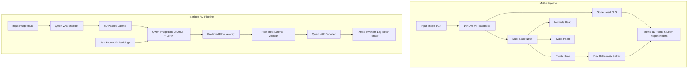

# Comprehensive Taxonomy: MoGe (v1, v2, v3) vs Marigold (v1, v2)

## Executive Summary

| Feature / Dimension | MoGe-1 | MoGe-2 | MoGe-3 | Marigold V1 | Marigold V2 |
| :--- | :--- | :--- | :--- | :--- | :--- |
| **Primary Authors / Lab** | Microsoft Research / USTC | Microsoft Research / USTC | Microsoft Research / USTC | ETH Zürich (Ke et al.) | Huawei Bayer Lab / EPFL / UniBo |
| **Venue / Year** | CVPR 2025 Oral | arXiv 2025 | arXiv 2026 | CVPR 2024 | SIGGRAPH Asia / ACM TOG 2026 |
| **Model Type** | Feedforward Discriminative ViT | Feedforward Discriminative ViT | Multi-Scale Sparse Volumetric ViT | Iterative Latent Diffusion (U-Net) | Single-Step Flow-Matching DiT |
| **Backbone Architecture** | DINOv2 ViT-L | DINOv2 ViT-S / B / L | DINOv2 ViT-L / ViT-G + Sparse Refiner | Stable Diffusion v2 U-Net | Qwen-Image-Edit-2509 DiT |
| **Quantization Support** | FP16 / BF16 | FP16 / BF16 | FP16 / BF16 + FlexGEMM Triton | FP16 / INT8 | NF4 4-bit BitsAndBytes / FP16 |
| **Forward Pass Output** | Canonical Affine 3D Point Map $(x', y', z')$, Mask, Normals | Canonical Point Map, Metric Scale $s$, Mask, Normals | Coarse Points + Sparse Refined Points, Metric Scale, Mask | Latent Noise $\epsilon_t \to$ Latent Pixel Grid | Latent Velocity $\mathbf{v} \to$ Decoded 3-channel RGB |
| **Depth Type** | Metric up to unknown camera shift & focal | **True Metric (Meters)** | **True Metric (Meters)** + Ultra-sharp edges | **Affine-Invariant Disparity** $[0, 1]$ | **Affine-Invariant Log-Depth** $[-1, 1]$ |
| **Camera Intrinsics** | Automatically Solved via Ray-Collinearity | Automatically Solved via Ray-Collinearity | Automatically Solved via Ray-Collinearity | None (Camera-Agnostic) | None (Camera-Agnostic) |
| **Scale Ambiguity** | Scale & Shift Ambiguous | **Scale & Shift Resolved** (True Metric) | **Scale & Shift Resolved** (True Metric) | Scale & Shift Ambiguous | Scale & Shift Ambiguous |
| **Inference Speed** | ~60ms (Feedforward) | ~60ms (Feedforward) | ~120ms (with 3-step refinement) | ~2.5s (10-50 steps) | ~350ms (Single-step DiT) |
| **Multi-View 360 Stitching** | Direct 3D Point Fusion or Metric Poisson | Direct 3D Point Fusion or Metric Poisson | Direct 3D Point Fusion or Metric Poisson | Requires Relative Align / Solvers | Requires Relative Align / Scale Calibration |

---

## 1. Mathematical Representation Breakdown

### 1.1 MoGe Coordinate & Geometry Formulation
MoGe frames monocular geometry estimation as direct **3D Point Cloud Regression in Camera Space**:

$$\mathbf{P}(u, v) = \begin{bmatrix} X(u, v) \\ Y(u, v) \\ Z(u, v) \end{bmatrix} \in \mathbb{R}^3$$

Where:
- $+X$: Rightward along image sensor.
- $+Y$: Downward along image sensor.
- $+Z$: Forward along optical axis (Planar depth $Z$).

#### MoGe-1 (Affine-Invariant Points):
MoGe-1 predicts points $\mathbf{P}' = (x', y', z')$ normalized such that:
$$Z(u, v) = z'(u, v) + s_z$$
$$\begin{bmatrix} u - c_x \\ v - c_y \end{bmatrix} = \begin{bmatrix} f_x \frac{X}{Z} \\ f_y \frac{Y}{Z} \end{bmatrix}$$
The solver `recover_focal_shift` exploits the collinearity constraint that every 3D point $\mathbf{P}$ must project onto ray $\mathbf{r} = K^{-1} [u, v, 1]^T$. This allows recovering camera focal length $f_x, f_y$ and depth shift $s_z$ in closed form!

#### MoGe-2 & MoGe-3 (Decoupled Metric Scale):
MoGe-2 and MoGe-3 add a dedicated **Scale Head** on the ViT `[CLS]` token:
$$s_{\text{metric}} = \exp(\text{MLP}(\mathbf{t}_{\text{CLS}})) \in \mathbb{R}^+$$
The final metric 3D point cloud and depth map are obtained by:
$$\mathbf{P}_{\text{metric}} = s_{\text{metric}} \cdot \mathbf{P}$$
$$Z_{\text{metric}} = s_{\text{metric}} \cdot (z' + s_z) \quad (\text{in meters})$$

---

### 1.2 Marigold Depth Formulation

#### Marigold V1 (Affine Disparity):
Marigold V1 fine-tunes Stable Diffusion to output affine-invariant inverse depth (disparity) $d \in [0, 1]$:
$$d_{\text{pred}} = \frac{1/Z - (1/Z)_{\min}}{(1/Z)_{\max} - (1/Z)_{\min}}$$

#### Marigold V2 (Affine Log-Depth):
Marigold V2 trains on normalized log-depth:
$$\ell(u, v) = \log(Z(u, v) + \epsilon)$$
$$d_{\text{norm}}(u, v) = 2 \cdot \frac{\ell(u, v) - \text{Percentile}_2(\ell)}{\text{Percentile}_{98}(\ell) - \text{Percentile}_2(\ell)} - 1 \quad \in [-1.0, 1.0]$$

During inference, Marigold V2 predicts $d_{\text{norm}}$. Notice that:
$$Z(u, v) = \exp\left( \alpha \cdot d_{\text{norm}}(u, v) + \beta \right)$$
Where $\alpha = \frac{p_{98} - p_2}{2}$ and $\beta = \frac{p_{98} + p_2}{2}$ are **unknown, scene-dependent scalar constants**.

---

## 2. Structural Comparison of Network Backbones

